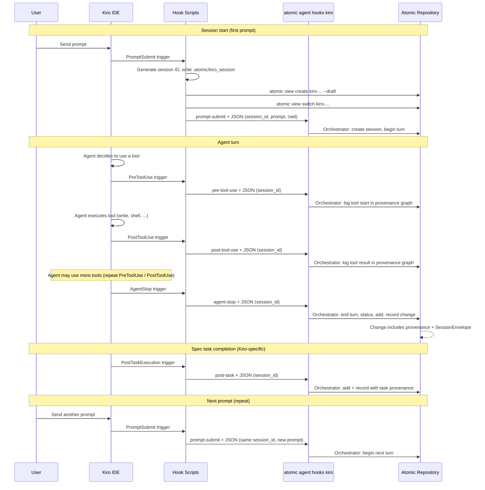

# atomic-kiro

[Atomic VCS](https://atomic.dev) integration for [Kiro IDE](https://kiro.dev).

Automatic turn recording with AI provenance, intent tracking, and knowledge graph skills.

## What it does

- **1 session = 1 view** — a draft view is created automatically when you start working in Kiro
- **Every turn records with provenance** — model, vendor, session, turn number, timing
- **Tool executions tracked** — reads, edits, shell calls captured in a causal decision graph
- **Intent workflow** — AGENTS.md prompt guides problem-first development with vault intents
- **Skills on demand** — `/atomic-vault` and `/code-intelligence` loaded when relevant
- **Spec-driven integration** — hooks fire on task execution for Kiro's spec workflow

## Install

### Quick start

```bash
# Clone and install
git clone https://github.com/atomicdotdev/atomic-kiro
cd atomic-kiro
./install.sh

# Copy the agent prompt into your project
cp AGENTS.md /path/to/your/project/
```

### From npm (once published)

```bash
npx atomic-kiro
```

### What install does

1. **Skills** — symlinks `/atomic-vault`, `/code-intelligence`, `/codebase-context`, and `/intent-builder` into `~/.kiro/skills/`
2. **Steering** — symlinks `atomic-agent.md` into `~/.kiro/steering/` (always-included Atomic context)
3. **Hooks** — prints instructions for configuring hooks in the Kiro IDE panel
4. **AGENTS.md** — must be copied to each project root manually (Kiro auto-discovers it)

## Prerequisites

- [Atomic VCS](https://atomic.dev) installed and on your PATH (`atomic --version`)
- A project with an `.atomic/` repository (`atomic init`)
- [Kiro IDE](https://kiro.dev) installed

## Usage

```bash
cd my-project
atomic init              # if not already an atomic repo
cp /path/to/atomic-kiro/AGENTS.md .  # copy agent prompt
# Open the project in Kiro — skills and steering activate automatically
```

## Configuring hooks

Kiro hooks are configured through the IDE panel. After running `install.sh`, set up these hooks:

### In the Kiro IDE

1. Open **Agent Steering & Skills** in the Kiro panel
2. Navigate to the **Hooks** section
3. Create these hooks:

| Trigger Type | Action | Command |
|---|---|---|
| **Prompt Submit** | Shell Command | `/path/to/atomic-kiro/hooks/prompt-submit.sh` |
| **Agent Stop** | Shell Command | `/path/to/atomic-kiro/hooks/agent-stop.sh` |
| **Pre Tool Use** (write, shell) | Shell Command | `/path/to/atomic-kiro/hooks/pre-tool-use.sh` |
| **Post Tool Use** (write, shell) | Shell Command | `/path/to/atomic-kiro/hooks/post-tool-use.sh` |
| **Post Task Execution** | Shell Command | `/path/to/atomic-kiro/hooks/post-task-execution.sh` |

### How hooks work



Every Atomic change recorded by the hooks contains:
- **Provenance** — model, vendor, tokens, cost, causal decision graph
- **SessionEnvelope** — session ID, turn number, timing, files modified
- **Transcript** (optional) — compressed in the change's unhashed section

You never need to run `atomic add` or `atomic record` — the hooks handle it.

## Viewing provenance

```bash
# Show the causal decision graph (goals → tool calls → patch)
atomic change -p <hash>

# Show inline AI attestation (model, tokens, cost)
atomic change -a <hash>

# Show session-level attestations
atomic agent attest
```

## What's in the package

| File/Directory | Purpose |
|---|---|
| `AGENTS.md` | Agent prompt — copy to project roots for intent-per-turn workflow |
| `steering/atomic-agent.md` | Always-included steering — Atomic VCS context for every interaction |
| `skills/atomic-vault/` | Vault workflow skill (`/atomic-vault`) |
| `skills/code-intelligence/` | KG query patterns (`/code-intelligence`) |
| `skills/codebase-context/` | Codebase exploration (`/codebase-context`) |
| `skills/intent-builder/` | Intent construction (`/intent-builder`) |
| `hooks/` | Shell scripts for Kiro hook triggers |
| `install.js` | Installs skills + steering into `~/.kiro/` |
| `install.sh` | Development install |

## Differences from atomic-claude

| Feature | atomic-claude | atomic-kiro |
|---|---|---|
| Agent prompt | `CLAUDE.md` | `AGENTS.md` (auto-discovered by Kiro) |
| Skills location | `~/.claude/skills/` | `~/.kiro/skills/` |
| Steering | N/A | `~/.kiro/steering/` (Kiro-specific) |
| Hook config | `~/.claude/settings.json` (automatic) | Kiro IDE panel (manual setup) |
| Subagents | `~/.claude/agents/` | N/A (use skills + steering) |
| Spec integration | N/A | Pre/Post Task Execution hooks |
| Hook mechanism | `atomic agent enable --agent claude-code` | Shell scripts + IDE configuration |

## Uninstall

```bash
npx atomic-kiro --uninstall
```

Or manually:

```bash
# Remove skills
rm ~/.kiro/skills/atomic-vault/SKILL.md
rm ~/.kiro/skills/code-intelligence/SKILL.md
rm ~/.kiro/skills/codebase-context/SKILL.md
rm ~/.kiro/skills/intent-builder/SKILL.md

# Remove steering
rm ~/.kiro/steering/atomic-agent.md
```

AGENTS.md files in project roots and hook configurations in Kiro IDE must be removed manually.

## License

Apache-2.0 — same as [Atomic VCS](https://github.com/atomicdotdev/atomic).
